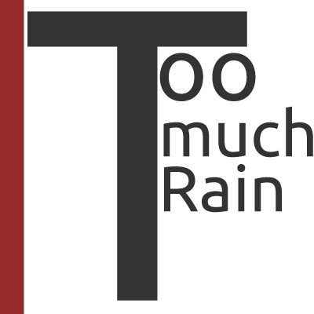

RainSjaman
=========

RainSjaman is a mod for people who think it rains too much. This mod will give you complete control.

## Links ##
Curse: [http://minecraft.curseforge.com/projects/rainsjaman](http://minecraft.curseforge.com/projects/rainsjaman)

Required mod: [K4Lib](http://minecraft.curseforge.com/mc-mods/224740-k4lib)

## License ##
This mod is released under the MMPLv2

## Pull requests ##
Yes, you can make pull requests for new variables, if implemented properly i'll merge them.

## Bugs ##
Please report bugs to the issues page. Put crashlogs in a pastebin or gist!

